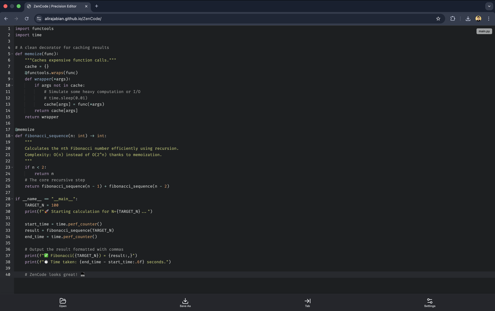

# ZenCode | Precision Editor 💻

ZenCode is a lightweight, browser-based code editor tailored for competitive programmers and developers. It features intelligent autocompletion for Python and C++, specifically designed to make coding faster and distraction-free.



## ✨ Key Features

* **Intelligent Autocomplete:** Custom-built snippet engine for **Python** and **C++** (includes STL containers like `std::vector`, `std::map`, and algorithms).
* **Dual Theme Support:** Switch seamlessly between **Light** (TextMate) and **Dark** (Tomorrow Night) modes for eye comfort.
* **Customizable Interface:** Adjustable font size (10px - 24px) using the Fira Code font.
* **File Management:** Open local files directly in the browser and save your code with a click.
* **Smart Syntax Highlighting:** Powered by the Ace Editor engine.
* **Responsive Design:** Optimized for various screen sizes with a clean, distraction-free UI.

## 🚀 Getting Started

ZenCode is designed to run completely offline (once dependencies are localized) or hosted on a simple static server.

### Prerequisites

You need a modern web browser (Chrome, Firefox, Safari, Edge).

### Installation

1.  Clone the repository:
    ```bash
    git clone [https://github.com/AliRajabian/ZenCode.git](https://github.com/AliRajabian/ZenCode.git)
    ```
2.  Navigate to the project directory:
    ```bash
    cd ZenCode
    ```
3.  Open `index.html` (or `main.html`) in your browser.

## 🛠️ Built With

* **[Ace Editor](https://ace.c9.io/)** (v1.32.3) - The high-performance code editor engine.
* **[Lucide Icons](https://lucide.dev/)** - Beautiful & consistent icons.
* **HTML5 & CSS3** - Uses CSS Variables for theming and Flexbox for layout.
* **Vanilla JavaScript** - No heavy frameworks, ensuring fast load times.

## 🤝 Contributing

Contributions are welcome! If you want to add snippets for a new language (like Java or Go), feel free to fork the repo and submit a pull request.

1.  Fork the Project
2.  Create your Feature Branch (`git checkout -b feature/NewLanguage`)
3.  Commit your Changes (`git commit -m 'Add Java snippets'`)
4.  Push to the Branch (`git push origin feature/NewLanguage`)
5.  Open a Pull Request

## 📝 License

Distributed under the MIT License. See `LICENSE` for more information.

## 👤 Author

* **Ali Rajabian** - [GitHub Profile](https://github.com/AliRajabian)
